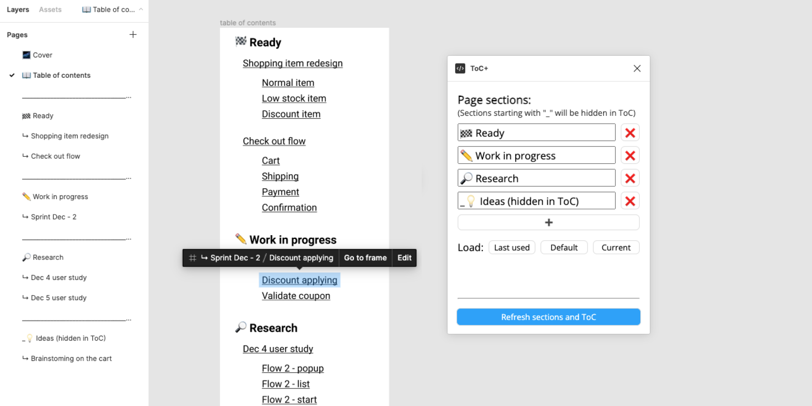

# Figma Plugin - ToC+

A figma plugin to help designers and viewers organize and navigate Figma files.

## Features

- Generate pages by sections in one-click
  - Customizable section names.
  - Parse existing file page sections, and saves previously used sections.
  - Allow hiding certain sections/pages/artboards from the ToC by starting the name with `_`.
- Generate table-of-contents
  - Organized by section > page > artboard.
  - Each page/artboard is clickable, links directly to that item.
  - Re-run anytime to fresh.
- Placeholder cover page
  - "Last updated" auto updates whenever the plugin runs.

## Load the plugin manually

This is only needed before the plugin is published, or you want to run a modified local version.

1. Download or clone this repo.
1. Install the desktop version of Figma (web version doesn't support loading local plugins).
1. Open any Figma Design file.
1. Right click anywhere in the working area, `Plugins > Development > Import plugin from manifest`.
1. Select the `manifest.json` file at the root of this repo.
1. Now you can start use it: `Plugins > Development > ToC+`.

## Development

- Main code all under `/src`:
  - `ui.html` for the UI part (with `<style>` and `<script>` inside).
  - All the `.ts` files for the code part.
  - DO NOT modify files under `/dist`, those are generated files, and will be overwritten everytime you compile.
- Bundled using `rollup.js`: (After editing source code, you must run either of these)
  - Install all dependencies (only for the 1st time) `npm install`.
  - Compile TS with auto re-run on saving: `npm start`.
  - Compile TS once: `npm build`.
- Final code:
  - compiled under `/dist`
  - `manifest.json`: the Figma Plugin entry point.
